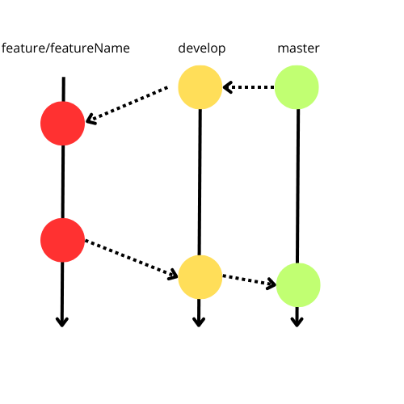

# Rapport équipe A

## 1. Point d'avancement

### Fonctionnalités réalisées

- Implémentation des règles de citadelles première édition avec un jeu de 67 cartes
    - 8 personnages avec des pouvoirs spécifiques
    - 67 quartiers dont 10 quartiers avec des pouvoirs spécifiques
    - Calcul des scores avec bonus

- Implémentation de 4 bots joueurs :
    - Bot aléatoire : joue aléatoirement
    - Bot économe : achète les quartiers les plus chers
    - Bot dépensier : achète les quartiers le plus rapidement possible
    - Bot monarchiste : achète les quartiers nobles en priorité et choisit le rôle de roi

### Fonctionnalités non réalisées

- Pas de prise en charge d'un septième joueur

### Logs

Utilisation de log4j pour les logs.

Les logs détaillés sont écrits seulement si l'argument --demo est passé au programme ou si
aucun argument n'est donné. Les logs détaillent une partie comprenant
la phase de sélection des personnages, les mises à jour de la main, cité et argent des bots ainsi que l'utilisation des
pouvoirs liés aux personnages et quartiers merveilles.
En fin de partie, les logs détaillent le score des bots.

Si l'argument --2thousands est donné, aucun log n'est écrit hormis les statistiques en fin
execution.

### Csv

Utilisation d'open csv pour la sauvegarde des statistiques des bots.
Chaque ligne représente les statistiques d'un bot.
Vous pouvez combiner l'option --csv avec --2thousands et --demo pour sauvegarder les statistiques des bots.

Par défaut, 100 000 parties sont jouées pour chaque bot, pour changer ce nombre, vous pouvez passer un argument --length
x
où x est le nombre de parties que vous souhaitez jouer.

### Bot Richard

Seulement certains éléments de Richard ont été implémentés.

Richard peut dans notre version definitive choisir un personnage adapté à sa stratégie.
Il peut également jouer le voleur, le condotierre, le magicien et l'assassin avec sa propre stratégie.

A noter que la stratégie de l'assassin ne suit pas toutes les règles énoncées dans le forum.

Certains élements ont été interpretés d'une certaine manière
comme le forum considéré donne des règles globales et non des règles spécifiques.

Par exemple :

- On considère qu'un joueur est en passe de gagner s'il a 5 quartiers ou plus
- C'est le dernier tour si un joueur a 6 quartiers

Le bot Richard est devenu notre bot le plus complexe et le plus complet
et a maintenant une stratégie plus élaborée qui lui permet de gagner plus de parties que les autres bots.

## 2. Architecture et qualité

### Architecture

L'architecture se décompose principalement en 3 packages :

- Le package cards contient principalement les classes représentant les cartes du jeu et leur pouvoir : District,
  Character, City et Hand
    - On a principalement une classe abstract Card qui est étendue par les classes District et Character. City et Hand
      sont des classes utilisées pour représenter la cité et la main des joueurs.
- Le package engine contient principalement les classes représentant le moteur du jeu : Game, Score, Statistic et
  Display
- Le package players contient principalement les classes représentant les joueurs : Player, Memory, Actions ainsi que
  les bots
    - On a principalement une classe abstract Player qui est étendue par chaque bot. Memory et Actions sont des classes
      utilisées par les bots pour se souvenir des élements importants et pour effectuer des actions.

Des sous packages sont également présents dans chacun de ces packages pour une meilleure organisation.
Nous avons choisi ce découpage pour une meilleure lisibilité du code et pour une meilleure séparation des
résponsabilités après avoir essayé plusieurs autres découpages. Notamment avec Player qui contenait initialement Memory
et Actions.

### JavaDoc

La JavaDoc est présente sur l'ensemble des classes et méthodes du projet. Elle est complète et à jour.
Vous la trouverez dans le dossier [doc](JavaDoc) en ouvrant l'index.html.

### Qualité du code

- Partie de bonne qualité :
    - Gestion du Score
    - Actions des joueurs
    - Gestion des statistiques

- Partie de moins bonne qualité :
    - L'activation des pouvoirs des quartiers
    - Les stratégies des bots
    - Duplication de code dans les bots

## 3. Processus de développement

### Assignement des tâches

Nous avons tous travaillé sur certains éléments du projet mais globalement, nous avons réparti les tâches de la manière
suivante :

- **Elian** :
    - Gestion de la pioche
    - Création des personnages
    - Création des quartiers
    - Implémentation des pouvoirs

- **Erwan** :
    - Bot Aléatoire
    - Bot Monarchiste
    - Organisation des joueurs
    - Implémentation des pouvoirs
    - Executions des 2000 parties

- **Dorian** :
    - Bot Econome
    - Bot Depensier
    - Affichage
    - Implémentation des pouvoirs
    - gestion des fichiers csv

- **Mathis** :
    - Gestion du score
    - Système de couronne
    - Implémentation des pouvoirs
    - Gestion des statistiques

### Gestion d'équipe

Branching strategy :

- Nous avons principalement utilisé une branche principale master et une branche de développement develop.
- Chaque fonctionnalité a été développée dans une branche dédiée à cette fonctionnalité nommée feature/featureName.
- Les refactorings et les corrections de bugs ont été développés dans des branches dédiées à ces tâches préfixé par le
  type de la tache.
- Les branches de fonctionnalités ont été merge dans develop une fois la fonctionnalité terminée.
- La branche develop a été merge dans master une fois la version définitive prête.

Voici un exemple de notre strategy de branching :

Github Actions :

- Nous avons utilisé Github Actions pour automatiser les tests dans le cadre de pull requests.

Chaque membre de l'équipe a eu l'occasion de valider les pull requests des autres membres de l'équipe.

